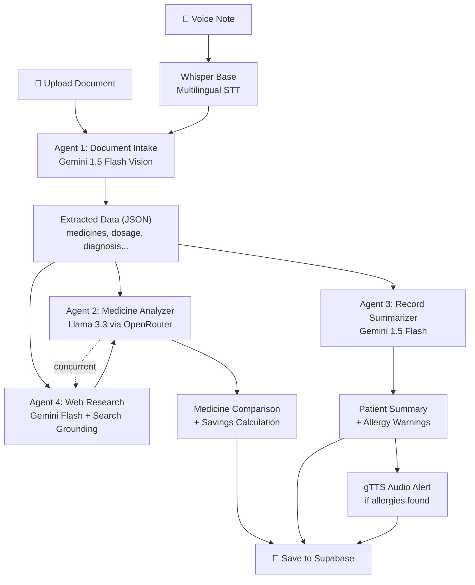

# Unified Personal Health Record & Affordable Medicine Intelligence — Backend

## Summary

A FastAPI backend with 4 AI agents for medical document processing, medicine alternative research, patient record summarization, and web price research. All data stored in Supabase (DB + Storage). Auth via Supabase JWT. Voice I/O via Whisper (local) and gTTS (free). Pharmacy discovery via Overpass API.

---

## Finalized Decisions

| Decision | Choice |
|---|---|
| **Agent 1 (Document Intake)** | Gemini 1.5 Flash — vision, own API key |
| **Agent 2 (Medicine Analyzer)** | `meta-llama/llama-3.3-70b-instruct:free` via OpenRouter |
| **Agent 3 (Record Summarizer)** | Gemini 1.5 Flash — own API key |
| **Agent 4 (Web Research)** | Gemini 1.5 Flash + Google Search Grounding — own API key |
| **TTS** | gTTS (Google Translate TTS) — free, no API key, supports Indian languages |
| **STT** | Whisper `base` model — multilingual (Hindi, Tamil, Telugu, Bengali, etc.) |
| **Medicine DB** | No local CSV — Agent 4 web search is the primary data source |
| **Pharmacy Search** | Overpass API → nearby stores + "Get Directions" link to maps |
| **File Sharing** | User-to-user sharing by email (no user/doctor differentiation) |
| **LLM Orchestration** | Direct API calls (no LangChain) — lightweight, fewer deps |
| **Database** | Supabase PostgreSQL (tables created via SQL migration) |
| **Storage** | Supabase Storage (buckets for prescriptions, voice, generated files) |

---

## Database Schema

### Table: `profiles`
Extends Supabase `auth.users`. Created automatically on signup.

| Column | Type | Notes |
|---|---|---|
| `id` | UUID (PK) | FK → `auth.users.id` |
| `full_name` | TEXT | |
| `age` | INTEGER | |
| `blood_group` | TEXT | e.g. "O+", "AB-" |
| `allergies` | TEXT[] | Array of known allergies |
| `chronic_conditions` | TEXT[] | Array of chronic conditions |
| `created_at` | TIMESTAMPTZ | DEFAULT now() |
| `updated_at` | TIMESTAMPTZ | DEFAULT now() |

### Table: `medical_records`
Every uploaded document.

| Column | Type | Notes |
|---|---|---|
| `id` | UUID (PK) | DEFAULT gen_random_uuid() |
| `patient_id` | UUID | FK → `profiles.id` |
| `file_url` | TEXT | Supabase Storage path |
| `file_type` | TEXT | 'prescription', 'lab_report', 'imaging' |
| `original_filename` | TEXT | |
| `extracted_data` | JSONB | Agent 1 structured output |
| `voice_note_url` | TEXT | nullable |
| `transcription` | TEXT | nullable (Whisper output) |
| `created_at` | TIMESTAMPTZ | DEFAULT now() |

### Table: `medicine_analyses`
Agent 2 + 4 combined results for each record.

| Column | Type | Notes |
|---|---|---|
| `id` | UUID (PK) | |
| `record_id` | UUID | FK → `medical_records.id` |
| `patient_id` | UUID | FK → `profiles.id` |
| `medicines` | JSONB | Array of medicine comparison objects |
| `total_savings` | NUMERIC | Rupees saved with generics |
| `created_at` | TIMESTAMPTZ | |

### Table: `patient_summaries`
Agent 3 output per patient.

| Column | Type | Notes |
|---|---|---|
| `id` | UUID (PK) | |
| `patient_id` | UUID | FK → `profiles.id` |
| `summary_text` | TEXT | Doctor-facing summary |
| `allergy_warnings` | JSONB | Array of warnings |
| `audio_url` | TEXT | nullable — gTTS audio file URL |
| `created_at` | TIMESTAMPTZ | |

### Table: `share_tokens`
24-hour expiring shareable links.

| Column | Type | Notes |
|---|---|---|
| `id` | UUID (PK) | |
| `patient_id` | UUID | FK → `profiles.id` |
| `token` | TEXT (UNIQUE) | Secure random token |
| `expires_at` | TIMESTAMPTZ | created_at + 24h |
| `created_at` | TIMESTAMPTZ | |

### Table: `shared_files`
Direct user-to-user file sharing.

| Column | Type | Notes |
|---|---|---|
| `id` | UUID (PK) | |
| `sender_id` | UUID | FK → `profiles.id` |
| `recipient_email` | TEXT | Email of recipient |
| `record_id` | UUID | FK → `medical_records.id` |
| `message` | TEXT | nullable — optional note |
| `is_read` | BOOLEAN | DEFAULT false |
| `created_at` | TIMESTAMPTZ | |

### Storage Buckets
- **`prescriptions`** — uploaded prescriptions, lab reports, imaging
- **`voice-notes`** — uploaded audio recordings
- **`generated-files`** — TTS audio, extracted medicine lists (JSON/TXT)

---

## Project Structure

```
d:\hackhorizon\
├── .env                        # All API keys & credentials
├── .gitignore
├── requirements.txt
├── main.py                     # FastAPI app entry point
├── scripts/
│   └── setup_database.sql      # Full migration SQL
│
├── core/
│   ├── __init__.py
│   ├── config.py               # Pydantic Settings (.env loader)
│   ├── auth.py                 # Supabase JWT dependency
│   └── supabase_client.py      # Supabase client singleton
│
├── models/
│   ├── __init__.py
│   └── schemas.py              # All Pydantic request/response models
│
├── agents/
│   ├── __init__.py
│   ├── agent_1_intake.py       # Gemini Flash Vision — doc extraction
│   ├── agent_2_analyzer.py     # Llama 3.3 via OpenRouter — medicine analysis
│   ├── agent_3_summarizer.py   # Gemini Flash — summarization + allergy check
│   └── agent_4_research.py     # Gemini Flash + Search Grounding — web prices
│
├── services/
│   ├── __init__.py
│   ├── whisper_service.py      # Local Whisper base multilingual
│   ├── tts_service.py          # gTTS (Google Translate TTS, free)
│   └── overpass_service.py     # Overpass API pharmacy search
│
└── api/
    ├── __init__.py
    └── routes/
        ├── __init__.py
        ├── records.py          # POST /api/records/upload, GET /api/records
        ├── medicines.py        # GET /api/medicines/{id}
        ├── share.py            # POST /api/share, GET /api/share/{token}, POST /api/share/file
        ├── summary.py          # GET /api/patient/summary
        ├── pharmacies.py       # GET /api/pharmacies/nearby
        └── voice.py            # POST /api/voice/transcribe, POST /api/voice/speak
```

---

## API Endpoints

| Method | Path | Auth | Description |
|---|---|---|---|
| `POST` | `/api/records/upload` | ✅ JWT | Upload document + optional voice → runs Agent 1 |
| `GET` | `/api/records` | ✅ JWT | List all records for authenticated patient |
| `GET` | `/api/medicines/{record_id}` | ✅ JWT | Get/trigger medicine analysis for a record (Agent 2+4) |
| `POST` | `/api/share` | ✅ JWT | Generate 24h share token link |
| `GET` | `/api/share/{token}` | ❌ Public | Doctor/anyone views patient history via token |
| `POST` | `/api/share/file` | ✅ JWT | Send a specific file to another user by email |
| `GET` | `/api/share/inbox` | ✅ JWT | View files shared with the authenticated user |
| `GET` | `/api/patient/summary` | ✅ JWT | Generate/get Agent 3 patient summary |
| `GET` | `/api/pharmacies/nearby` | ✅ JWT | Query Overpass for pharmacies within 2km |
| `POST` | `/api/voice/transcribe` | ✅ JWT | Upload audio → Whisper transcription |
| `POST` | `/api/voice/speak` | ✅ JWT | Text → gTTS audio file |
| `POST` | `/api/auth/signup` | ❌ Public | Register new user via Supabase Auth |
| `POST` | `/api/auth/login` | ❌ Public | Login → returns JWT |
| `PUT` | `/api/profile` | ✅ JWT | Create/update health profile |
| `GET` | `/api/profile` | ✅ JWT | Get health profile |

---

## Agent Pipeline Flow



---

## Proposed Changes

### Core Infrastructure

#### [NEW] `.env`
All credentials: `SUPABASE_URL`, `SUPABASE_ANON_KEY`, `SUPABASE_SERVICE_ROLE_KEY`, `GEMINI_API_KEY`, `OPENROUTER_API_KEY`.

#### [NEW] `.gitignore`
Standard Python gitignore + `.env`, `venv/`, `__pycache__/`, whisper model cache.

#### [NEW] `requirements.txt`
`fastapi`, `uvicorn`, `supabase`, `python-dotenv`, `google-genai`, `httpx`, `openai-whisper`, `gTTS`, `pydantic`, `python-multipart`, `PyJWT`, `python-jose`, `Pillow`, `pdf2image`/`PyPDF2`.

#### [NEW] `main.py`
FastAPI app with CORS middleware, lifespan for Whisper model preloading, all router includes.

---

### Core Module

#### [NEW] `core/config.py`
Pydantic `BaseSettings` loading all env vars with validation.

#### [NEW] `core/auth.py`
FastAPI dependency that extracts and verifies Supabase JWT from `Authorization: Bearer` header. Returns the authenticated `user_id`.

#### [NEW] `core/supabase_client.py`
Singleton Supabase client initialization (both anon and service-role clients).

---

### Agents

#### [NEW] `agents/agent_1_intake.py`
- Accepts image bytes or PDF bytes + optional transcription text
- Converts PDF pages to images if needed
- Calls Gemini 1.5 Flash with vision prompt
- Returns structured JSON: `{medicines, dosage, frequency, diagnosis, doctor_name, hospital, date}`

#### [NEW] `agents/agent_2_analyzer.py`
- Receives medicine list from Agent 1
- Concurrently calls Agent 4 for web prices
- Combines web research data
- Calls Llama 3.3 via OpenRouter to analyze alternatives, calculate savings, check safety equivalence
- Returns full comparison JSON

#### [NEW] `agents/agent_3_summarizer.py`
- Receives all patient records + patient profile (allergies, conditions)
- Calls Gemini Flash to generate doctor-facing summary
- Cross-checks prescriptions against allergies
- If allergy conflict found → generates warning + triggers gTTS audio alert
- Returns summary + warnings + audio URL

#### [NEW] `agents/agent_4_research.py`
- Receives medicine names
- Calls Gemini Flash with Google Search Grounding enabled
- Searches for: current Indian prices (brand vs generic), CDSCO approval status, availability
- Returns structured price/availability JSON

---

### Services

#### [NEW] `services/whisper_service.py`
- Loads Whisper `base` model at startup (multilingual)
- Accepts audio file bytes → returns transcription text
- Auto-detects language (English, Hindi, Tamil, etc.)

#### [NEW] `services/tts_service.py`
- Uses `gTTS` library (free, no API key)
- Accepts text + language code → generates MP3
- Uploads MP3 to Supabase Storage → returns URL
- Supports: en, hi, ta, te, bn, mr, gu, kn, ml

#### [NEW] `services/overpass_service.py`
- Accepts latitude, longitude
- Queries Overpass API for pharmacies within 2km radius
- Returns list of `{name, lat, lon, address, distance_km, directions_url}`
- `directions_url` links to OpenStreetMap/Google Maps for navigation

---

### API Routes

#### [NEW] `api/routes/records.py`
Upload handler: receive file + optional voice note → store in Supabase Storage → trigger Agent 1 → store extracted data → save medicine list as JSON to storage → return record.

#### [NEW] `api/routes/medicines.py`
Trigger Agent 2+4 pipeline for a given record ID → store results → return comparison.

#### [NEW] `api/routes/share.py`
Generate secure token (24h expiry), public view endpoint, user-to-user file sharing, inbox.

#### [NEW] `api/routes/summary.py`
Trigger Agent 3 for authenticated patient → store summary → return.

#### [NEW] `api/routes/pharmacies.py`
Proxy to Overpass service with user's GPS coordinates.

#### [NEW] `api/routes/voice.py`
Whisper transcription endpoint and gTTS synthesis endpoint.

---

### Database Setup

#### [NEW] `scripts/setup_database.sql`
Complete SQL migration with all 6 tables, RLS policies, storage bucket creation, and indexes.

---

## Verification Plan

### Automated Tests
1. Start the server with `uvicorn main:app --reload`
2. Test each endpoint via the FastAPI `/docs` Swagger UI
3. Verify Supabase table creation by querying tables
4. Test Agent 1 with a sample prescription image
5. Test Whisper with a short audio clip

### Manual Verification
- Confirm all tables exist in Supabase Dashboard
- Confirm storage buckets are created
- Test the share token flow end-to-end
- Verify Overpass returns pharmacies for Indian coordinates
